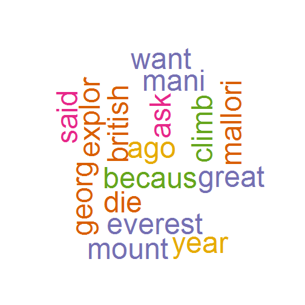
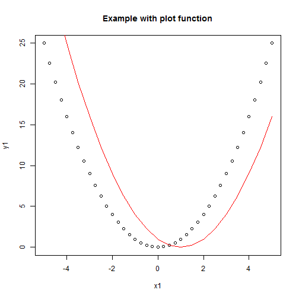
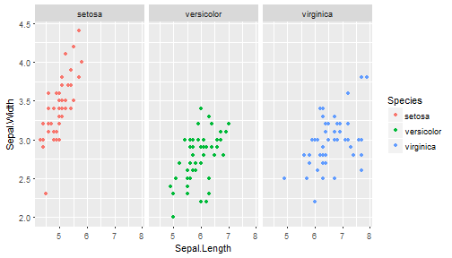

<style>
.small-code pre code {
  font-size: 1em;
}
</style>

Let's Code - Week 8
========================================================
author: Adrien ROUX
date: January, 2017
autosize: true


Data visualisation
========================================================
class: small-code

Data visualisation covers

* 2d plots (histogram, points, lines),
* 3d plots (3d points, 3d lines,surface,...),
* geo maps,
* word clouds,
* network representations.


Word clouds (1/.)
========================================================
class: small-code

We first read some text.


```r
text <- "Many years ago the great British explorer George Mallory, who 
was to die on Mount Everest, was asked why did he want to climb 
it. He said, \"Because it is there.\""
```

Now, we will perform a series of operations on the text data to simplify it.


```r
library(tm)
library(SnowballC)
library(wordcloud)

# 1. we need to create a corpus.
myCorpus <- Corpus(VectorSource(text)) #tm function

# 2. we convert the corpus to a plain text document.
myCorpus <- tm_map(myCorpus, PlainTextDocument)

# 3. we remove all punctuation and stopwords. 
# Stopwords are commonly used words in the English language such as I, me, my, etc. You can see the full list of stopwords using stopwords('english').

myCorpus <- tm_map(myCorpus, removePunctuation)
myCorpus <- tm_map(myCorpus, removeWords, stopwords('english'))
```

Word clouds (2/.)
========================================================
class: small-code


```r
# 4. we perform stemming. 
# This means that all the words are converted to their stem (Ex: learning -> learn, walked -> walk, etc.). This will ensure that different forms of the word are converted to the same form and plotted only once in the wordcloud.

myCorpus <- tm_map(myCorpus, 
                   stemDocument)
```

Now, we plot the wordcloud using a palette of colors instead of just one.


```r
library(RColorBrewer)
pal <- brewer.pal(6,"Dark2")
```

*** 


```r
 wordcloud(myCorpus, max.words = 100, 
          scale = c(4,0.5), random.order = FALSE,
          random.color = TRUE, colors = pal[-(1)],
          rot.per = 0.5)
```



Word clouds (3/.)
========================================================
class: small-code


```r
library(wordcloud2)
#wc <- wordcloud2(demoFreq)
#wc
```

2d plots (1/.)
========================================================
class: small-code

3 different plotting systems/solutions:

* **standard method** using base package : plot (**ugly but simple** so fits your prupose if you quickly want to have an overview of your data in console mode),
* **lattice graphics** : emphasis on multivariate data (**ugly and complex** so I don't present it)
* **ggplot2** : *so pretty* but not so simple at the beginning. The best option to put graphs in a report. 

***


```r
x1 <- seq(from=-5,to=5,by=0.25)
y1 <- sapply(x1, function(x){x^2})
plot(x1,y1, type="point", main= "Example with plot function")

x2 <- seq(from=-5,to=5,by=0.5)
y2 <- sapply(x2, function(x){(x-1)^2})
lines(x2,y2, col="red")
```



2d plots (2/.)
========================================================
class: small-code


```r
library(ggplot2)
str(iris)
```

```
'data.frame':	150 obs. of  5 variables:
 $ Sepal.Length: num  5.1 4.9 4.7 4.6 5 5.4 4.6 5 4.4 4.9 ...
 $ Sepal.Width : num  3.5 3 3.2 3.1 3.6 3.9 3.4 3.4 2.9 3.1 ...
 $ Petal.Length: num  1.4 1.4 1.3 1.5 1.4 1.7 1.4 1.5 1.4 1.5 ...
 $ Petal.Width : num  0.2 0.2 0.2 0.2 0.2 0.4 0.3 0.2 0.2 0.1 ...
 $ Species     : Factor w/ 3 levels "setosa","versicolor",..: 1 1 1 1 1 1 1 1 1 1 ...
```

```r
qplot(Sepal.Length, 
      Sepal.Width,
      data=iris, 
      color= Species) + facet_grid(.~Species)
```



